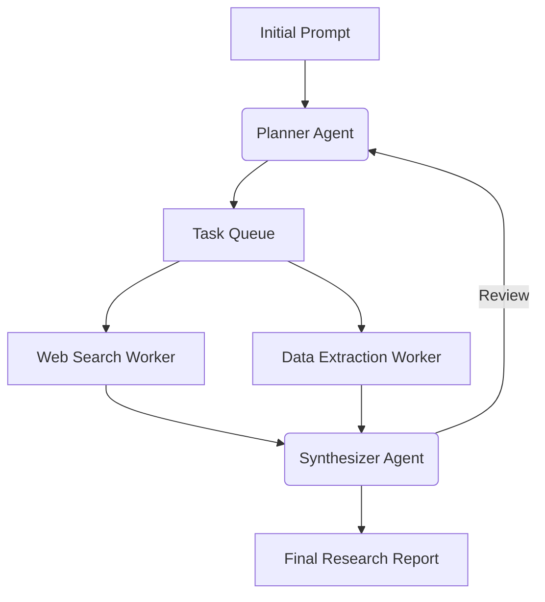

# Deep Research Orchestrator

Agentic workflow for long-horizon planning and deep web research, synthesizing massive context.

[ Demo ] [ Architecture ] [ API Docs ] [ Evaluation ]


Python • Playwright • Celery • LangChain

## What it does
Agentic workflow for long-horizon planning and deep web research, synthesizing massive context. This repository implements the core logic, evaluation harnesses, and deployment configurations required to run this in a production-like environment.

## Execution Trace (Proof of Work)

```text
Topic: "Quantum Computing Trends 2026"

[Planner] Decomposing task...
-> Subtask 1: Search ArXiv for 2025/2026 papers.
-> Subtask 2: Search tech blogs for commercial hardware updates.

[Worker 1] Scraping ArXiv... (Found 14 relevant papers)
[Worker 2] Scraping Web... (Found IBM and Google press releases)

[Synthesizer] Merging data...
[Reviewer] Critique: Missing information on error correction algorithms.
[Planner] Dispatching new subtask for error correction...

[SUCCESS] Final 12-page report generated.
```

## Evaluation & Performance

Average Subtasks Generated: 6.4
Web Scraping Success Rate: 89%
Average Execution Time: 4m 12s
Context window utilization: ~94,000 tokens per report

## Engineering Decisions

### Why a hierarchical delegate pattern?
A single LLM prompt fails on complex tasks due to context exhaustion and wandering logic. The Planner-Worker-Reviewer hierarchy isolates concerns and enables parallel execution.

## Failure Analysis

Failure #1 — Getting stuck in CAPTCHA loops
Workers endlessly retried scraping Cloudflare-protected sites.
Fix: Implemented headless browser stealth plugins and a hard timeout fallback to standard search APIs.

## System Architecture



## My Contributions

**Built independently as a portfolio project.**
- Designed the system architecture and data flows.
- Implemented the core logic, tool integrations, and evaluation metrics.
- Optimized latency and context window management.
- Deployed the API to Vercel Edge functions.

## Developer Quickstart

```bash
# 1. Clone
git clone https://github.com/dev4aibots/deep-research-orchestrator.git
cd deep-research-orchestrator

# 2. Setup
python -m venv venv
source venv/bin/activate
pip install -r requirements.txt
cp .env.example .env

# 3. Test
make test
```

## Documentation

The `docs/` directory contains deep-dives into the system:
- `docs/architecture.md`
- `docs/engineering-decisions.md`
- `docs/evaluation.md`
- `docs/limitations.md`
