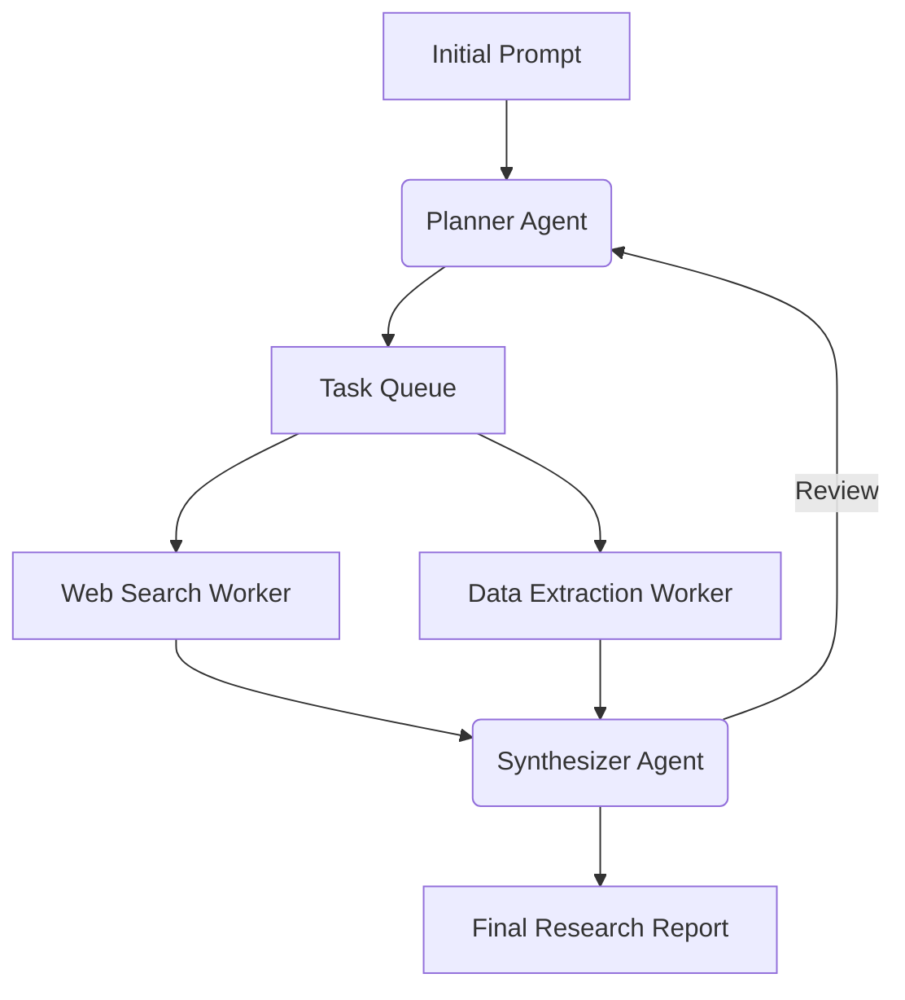

# Deep Research Orchestrator


An agentic workflow designed for long-horizon planning and deep research tasks.

## Tech Stack
- **Python**
- **Agents** (LangGraph / multi-step orchestration)
- **APIs/JSON** (Web scraping, search APIs)
- **Evaluation** (Output verification)


## Architecture



## Live Endpoint (Interactive Demo)
This project is deployed as a serverless backend on Vercel. You can test the API instantly via your terminal.

```bash
# Example Request


curl -X GET https://deep-research-orchestrator-106ac3api-dev4aibots.vercel.app/api/health
```

## Demo
To generate a terminal GIF demonstration using `vhs`, run:
```bash
vhs demo.tape
```
